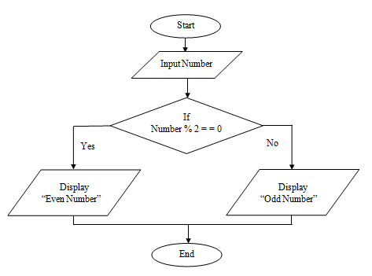

## 1. Documenting Workflows

This chapter will give you a intuitive introduction to workflows and why
they are so important for scientific work. We need a basic knowledge about what
a workflow itself is. Then we will discuss what provenence in terms of workflows mean.
We will conclude this chapter by answering and motivatong the question about
why we should document workflows

# 1.1 Workflow
According to the [Oxford Dictionary](https://www.lexico.com/definition/workflow), a
workflow is "... a sequence of industrial, administrative, or other processes through
which a piece of work passes from initiation to completion."

We learn two things from this brief definition, the first thing is that a workflow
has a starting/ending point. The second insight from the definition is, that we
have multiple stages,steps, processes between the initiation and completion. When we
think of a scientific environment, a workflow can be interpreted as a precise
description of a scientific procedure.
Such a procedure consists of three basic components:

            Input (information or material required)
                                ↓
              Transformation (rules or algorithms)
                                ↓
             Output (information or material produced)

When talking about workflows, we have to distinguish between two different kinds of
workflows.

            1. Informal Workflows (Flow charts, Commented Scripts, ...)
            2. Formal Workflows (Kepler Software, VisTrails, ...)

From introductory programming courses you might know **Flow charts**.

  <figure>
    
    
    <figcaption>Lamp-Flow chart (left) and Even Number Algorithm Flow chart (right)</figcaption>
  </figure>

Flow Charts are nothing more than simple visualizations of workflows. As you can see
in both pictures, there is a beginning ("Lamp doesn't work", "Start") followed by
some transformations ("Lamp plugged in?", "If number % 2 == 0") and the end
("Repair lamp", "End").

**Commented Scripts** only means well documented code. That means by adding global
information at the top of a script (author, date, functionality), followed by a
description of the most important code sections. To make Code more readable you could
and should use some programming guidelines. Uner this link you can find [Google's Style Guides](https://google.github.io/styleguide/) for a variety o programming languages.
